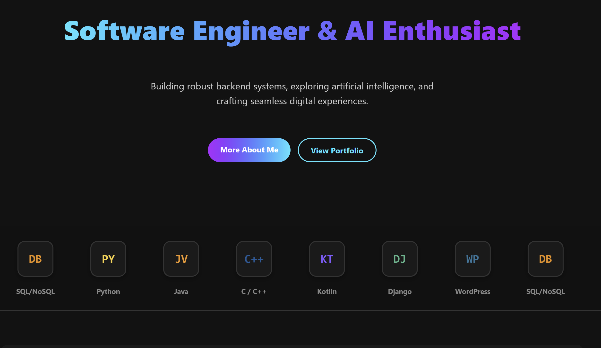
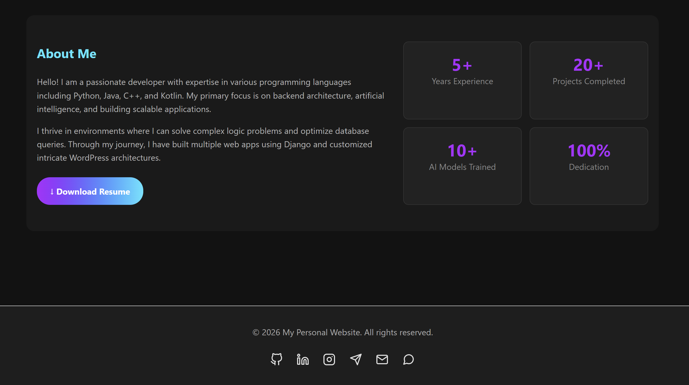
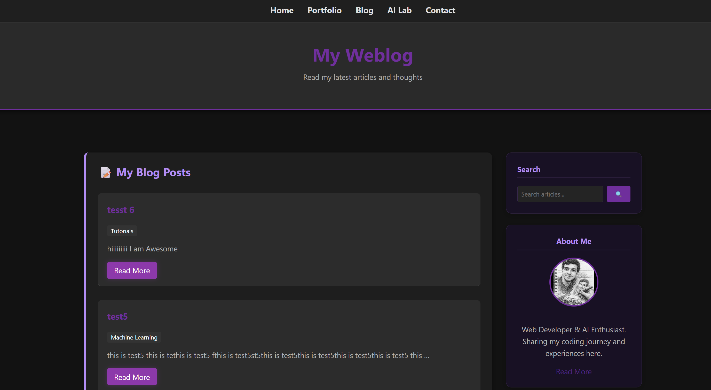
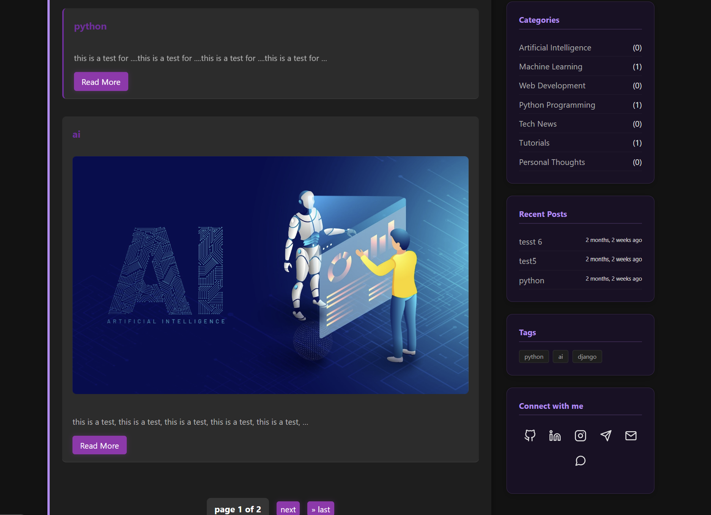
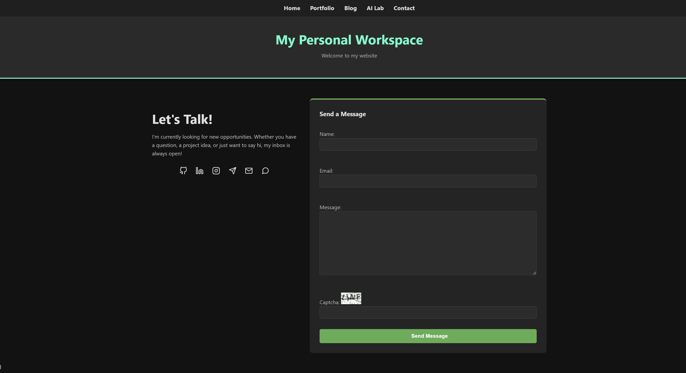
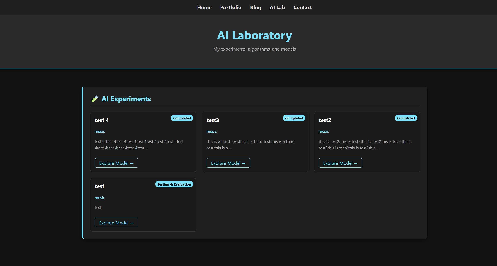
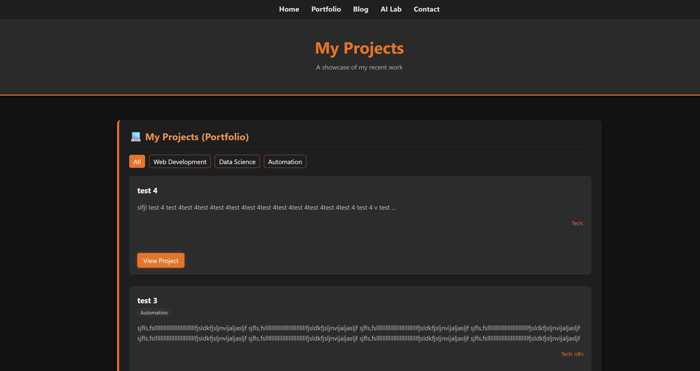

# 🚀 Django Personal Portfolio & AI Lab

[](https://www.python.org/)
[](https://www.djangoproject.com/)
[](https://opensource.org/licenses/MIT)
[](https://github.com/AliJohari05/My-Personal-Portfolio-Built-with-Django/graphs/commit-activity)

A sophisticated, fully-responsive personal portfolio website built with **Django**. This project showcases my professional journey, technical projects, and includes a dedicated **AI Lab** section for experimental tools and research.

---

## 📸 Preview









---

## ✨ Key Features

- 🛠 **Dynamic Portfolio:** Showcase projects with categories, tags, and detailed descriptions.
- ✍️ **Blog Engine:** Full-featured blog with Markdown support and comment system.
- 🤖 **AI Lab Section:** A specialized area to host and demo AI/ML experiments.
- 📩 **Contact System:** Functional contact form with email notifications.
- 🔐 **Secure Admin Panel:** Easy management of all content through Django's admin interface.
- 📱 **Fully Responsive:** Optimized for Mobile, Tablet, and Desktop.
- 🔍 **SEO Optimized:** Clean URL structures and meta-tag readiness.

---

## 🛠 Tech Stack

- **Backend:** Python / Django
- **Database:** SQLite (Development) / PostgreSQL (Production ready)
- **Frontend:** Bootstrap 5, Custom CSS, JavaScript
- **Icons:** FontAwesome / Boxicons
- **Environment:** Decoupled settings using `python-dotenv`

---

## 🚀 Getting Started

### 1. Prerequisites
- Python 3.x installed
- Git installed

### 2. Installation & Setup

Clone the repository:
```bash
git clone [https://github.com/AliJohari05/My-Personal-Portfolio-Built-with-Django.git](https://github.com/AliJohari05/My-Personal-Portfolio-Built-with-Django.git)
cd My-Personal-Portfolio-Built-with-Django

# Windows
python -m venv venv
venv\Scripts\activate

# Linux/Mac
python3 -m venv venv
source venv/bin/activate
Install dependencies:

bash
pip install -r requirements.txt
3. Database Initialization
bash
python manage.py migrate
python manage.py createsuperuser
4. Run the Server
bash
python manage.py runserver
Visit http://127.0.0.1:8000 to see your site!

📂 Project Structure
text
├── core/               # Project configuration & settings
├── portfolio/          # Project management app
├── blog/               # Blog & Articles app
├── ai_lab/             # AI experiments & demos
├── static/             # CSS, JS, and Image assets
├── templates/          # Global HTML templates
├── media/              # User-uploaded files (Images, etc.)
├── .gitignore          # Files to ignore in Git
└── manage.py           # Django management script
🛠 Future Roadmap
[ ] Integration with OpenAI API for AI Lab tools.
[ ] Dockerization for easier deployment.
[ ] Dark Mode support.
[ ] Integrating a Newsletter system.
👤 Author
Ali Johari

GitHub: @AliJohari05

LinkedIn: Ali Johari

Email: alitehranijohari1384@gmail.com
📄 License
This project is licensed under the MIT License - see the LICENSE file for details.